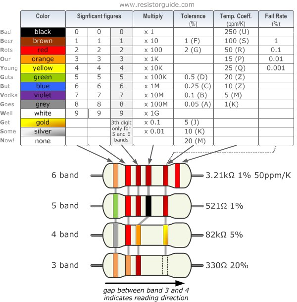
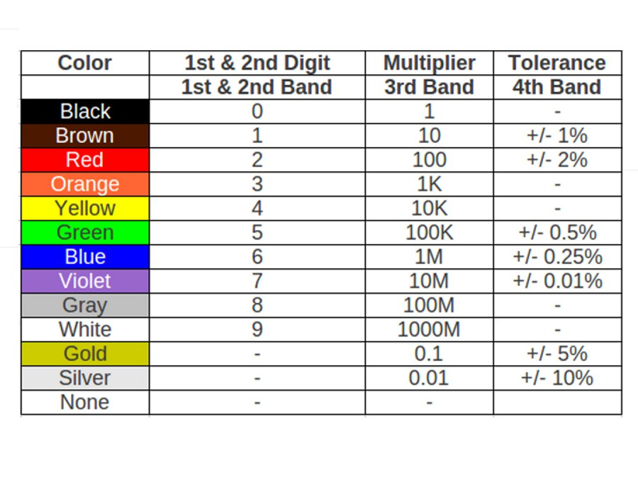

# Resistors
How to use Resistors in circuits 
# resistor color codes
Resistor Colour Coding uses coloured bands to easily identify a resistors resistive value and its percentage tolerance

There are many different types of Resistor available which can be used in both electrical and electronic circuits to control the flow of current or to produce a voltage drop in many different ways. But in order to do this the actual resistor needs to have some form of “resistive” or “resistance” value. Resistors are available in a range of different resistance values from fractions of an Ohm ( Ω ) to millions of Ohms

Obviously, it would be impractical to have available resistors of every possible value for example, 1Ω, 2Ω, 3Ω, 4Ω etc, because literally tens of hundreds of thousands, if not tens of millions of different resistors would need to exist to cover all the possible values. Instead, resistors are manufactured in what are called “preferred values” with their resistance value printed onto their body in coloured ink.

The resistance value, tolerance, and wattage rating are generally printed onto the body of the resistor as numbers or letters when the resistors body is big enough to read the print, such as large power resistors. But when the resistor is small such as a 1/4 watt carbon or film type, these specifications must be shown in some other manner as the print would be too small to read.

So to overcome this, small resistors use coloured painted bands to indicate both their resistive value and their tolerance with the physical size of the resistor indicating its wattage rating. These coloured painted bands produce a system of identification generally known as a **Resistors Colour Code**.

An international and universally accepted resistor colour code scheme was developed many years ago as a simple and quick way of identifying a resistors ohmic value no matter what its size or condition. It consists of a set of individual coloured rings or bands in spectral order representing each digit of the resistors value

The resistor colour code markings are always read one band at a time starting from the left to the right, with the larger width tolerance band oriented to the right side indicating its tolerance. By matching the colour of the first band with its associated number in the digit column of the colour chart below the first digit is identified and this represents the first digit of the resistance value.

Again, by matching the colour of the second band with its associated number in the digit column of the colour chart we get the second digit of the resistance value and so on. Then the resistor colour code is read from left to right as illustrated below
# The standard resistor color code chart.

# resistor color code tables

Then we can summerise the different weighted positions of each coloured band which makes up the resistors colour code above in the following tables.

# Calculation of resistor code values
The Resistor Colour Code system is all well and good but we need to understand how to apply it in order to get the correct value of the resistor. The “left-hand” or the most significant coloured band is the band which is nearest to a connecting lead with the colour coded bands being read from left-to-right as follows:

Digit, Digit, Multiplier = Colour, Colour x 10 colour  in Ohm’s (Ω)

For example, a resistor has the following coloured markings;

Yellow Violet Red = 4 7 2 = 4 7 x 102 = 4700Ω or 4k7 Ohm

The fourth and fifth bands are used to determine the percentage tolerance of the resistor. **Resistor tolerance** is a measure of the resistors variation from the specified resistive value and is a consequence of the manufacturing process and is expressed as a percentage of its “nominal” or preferred value.

Typical resistor tolerances for film resistors range from 1% to 10% while carbon resistors have tolerances up to 20%. Resistors with tolerances lower than 2% are called precision resistors with the or lower tolerance resistors being more expensive.

# Other guides

