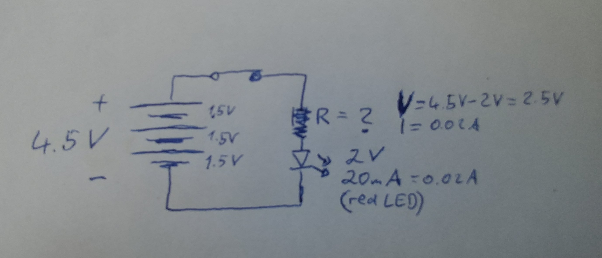

# Resistor
## Function
1. Reducing the current flow
2. Protecting LEDs
3. Defining the current for the circuit

**Description**

A resistor is meant to reduce or regulate the current in a circuit. For other purposes and details like dividing voltage etc. see [{1}](https://en.wikipedia.org/wiki/Resistor).

## Calculation
Here is how you would calculate:

`R= V/I` 

Resistance=Voltage (V) /devided by Current (I)

The Voltage is defined by the place where you need the resistance in the circuit. 

## Examples

**LED Protection**

Let's say we have a red LED which needs about 1.8 to 2.0V to run and the circuit is powered by 4.5V and we want the LED light up bright (0.02A). So we need to find the 'leftover' Voltage in the circuit on the resistor. So we need to calculate the remaining voltage on the resistor. 

The LED needs about 2V, so from the 4.5V we're left with 2.5V for the resistor and use it for the calculation.

`R=V/I=2.5V/0.02A`

`R=125Ω`

----
**Notes:**

> 1000 mA= 1 A

> V/A=Ω=Ohm

----
**Sources:**

{1} https://en.wikipedia.org/wiki/Resistor

